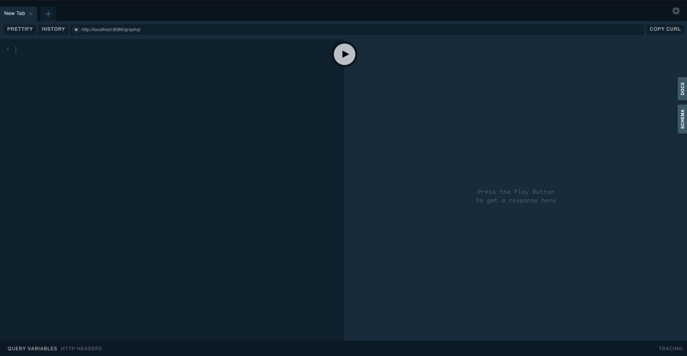
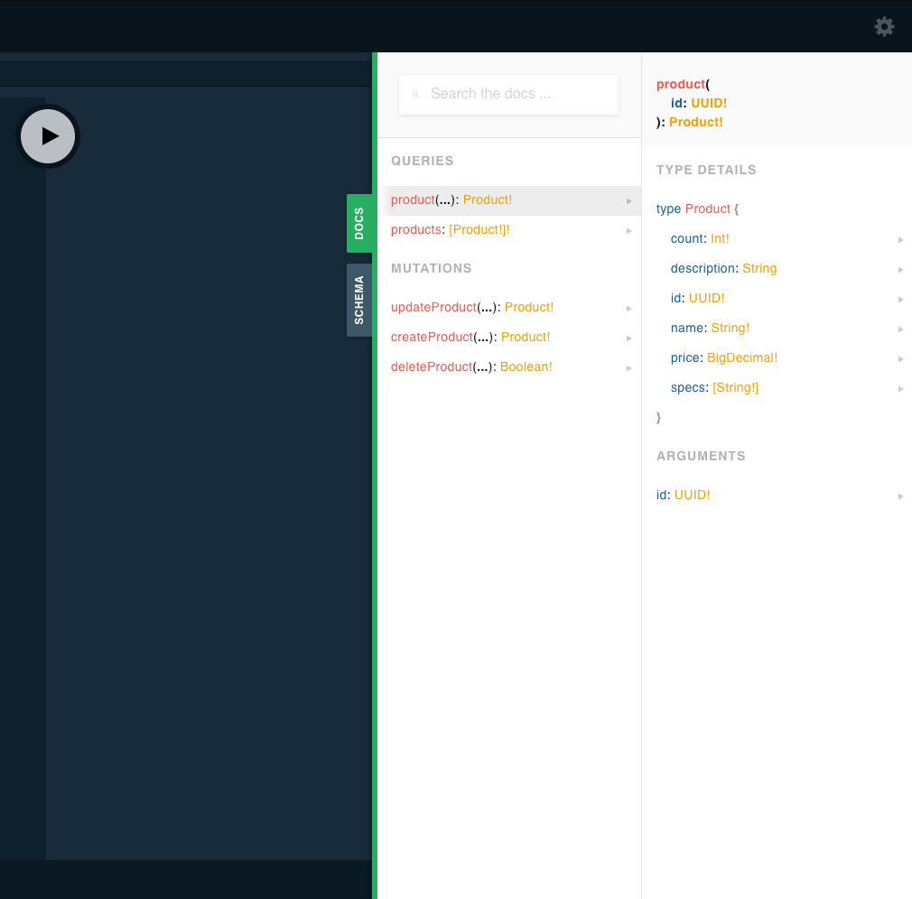
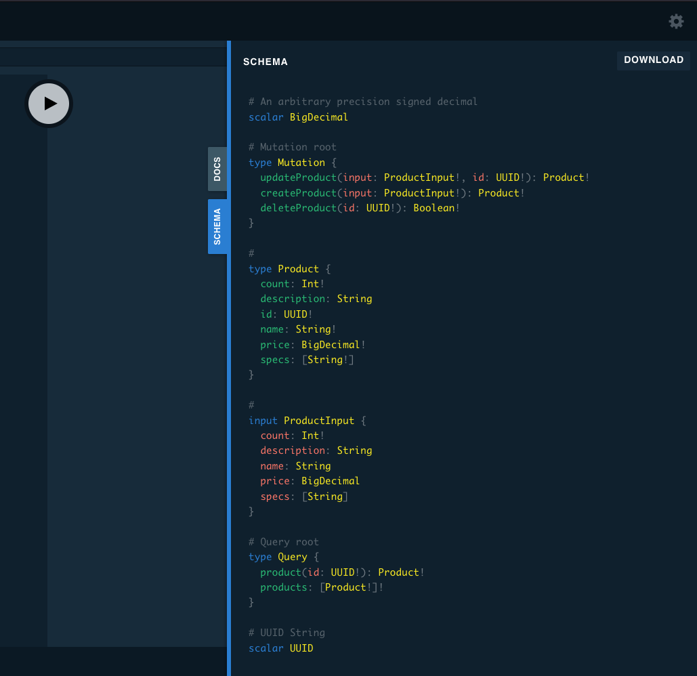
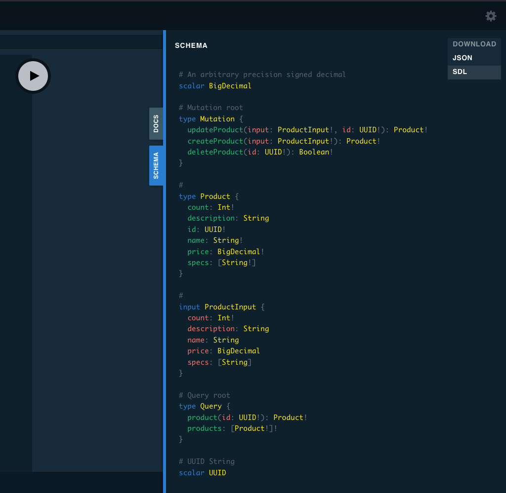
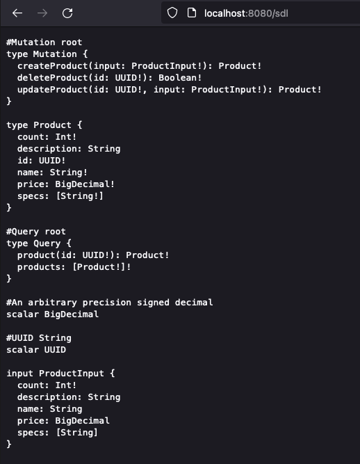
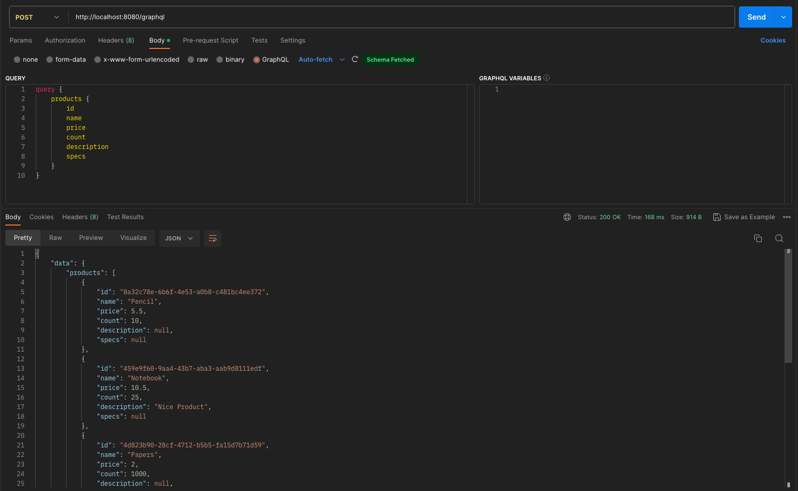
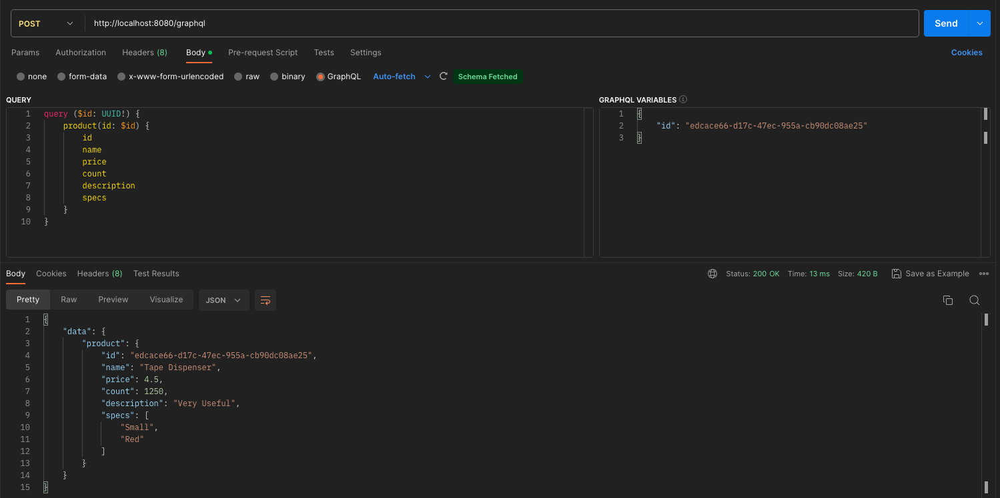
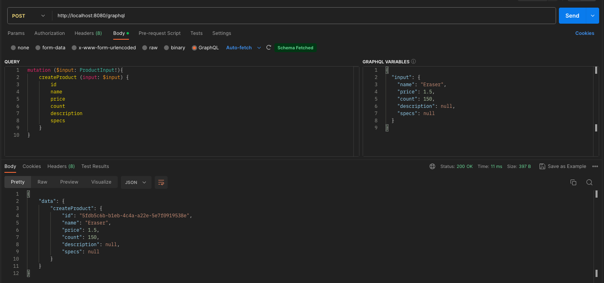
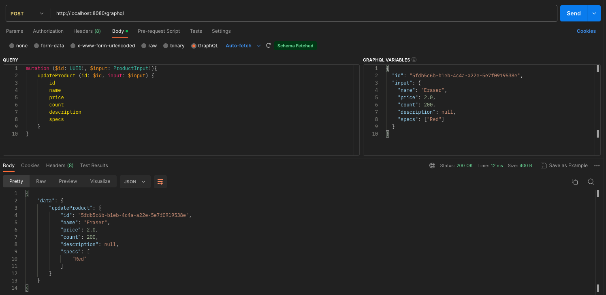
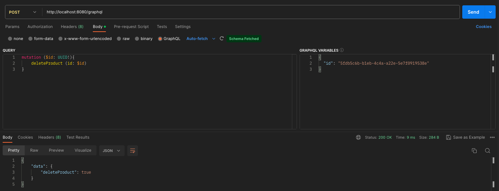

# Spring Boot SPQR - Code First GraphQL
In the project, a code first graphql application has been written with Spring Boot SPQR. By using SPQR, graphql schemas are generated automatically.

## GUI
You can add the following configuration to enable the graphql gui.
```yaml
graphql:
  spqr:
    gui:
      enabled: true
```

Open the gui with browser.

```
http://localhost:8080/gui
```



You can review the generated document and schemas from the tab on the side.





Also, you can download the sdl from Download button.



Or you can get the generated SDL by sending a request to the /sdl path without downloading the file.



## Demo











## Configuration
By default, SPQR library generates schemas by automatically adding the INPUT suffix to the class name used as input. But, I do not want it.
I prefer to create the name of the class I want to use as input by adding the INPUT suffix.
For this, I inherited the DefaultTypeInfoGenerator in the InputTypeNameGeneratorConfiguration file and overwrote the generateInputTypeName method.

Example:
1) Not overwrite the DefaultTypeInfoGenerator#generateInputTypeName case

```kotlin
@GraphQLMutation 
fun createProduct(input: ProductInput): Product
```

Generated Schema:
```
type Muation {
  createProduct(input: ProductInputInput!): Product!
}
```

2) Overwrite the DefaultTypeInfoGenerator#generateInputTypeName case

```kotlin
@GraphQLMutation 
fun createProduct(input: ProductInput): Product
```

Generated Schema:
```
type Muation {
  createProduct(input: ProductInput!): Product!
}
```

The configuration:

```kotlin
@Configuration
class InputTypeNameGeneratorConfiguration : DefaultTypeInfoGenerator() {

    override fun generateInputTypeName(type: AnnotatedType?, messageBundle: MessageBundle?): String {
        return this.generateTypeName(type, messageBundle)
    }
}
```

If you are using java and want to specify non-null fields in graphql schemas, you can use the @GraphQLNonNull annotation (by default, all fields are nullable).
If you are using kotlin, this annotation does not work by default. To do this, you need to add the '-Xemit-jvm-type-annotations' parameter to the compiler.

However, if you are using Kotlin, you would prefer not to use this annotation. 
Because you can define null or non-null fields in Kotlin language and it would be better to generate schemas accordingly. 
Otherwise, you must constantly add this annotation to all non-null fields.

I wrote a configuration called SchemaTransformerConfiguration to automatically find null or non-null fields in Kotlin classes and generate schemas accordingly.

To do this, I used source [KotlinTypesSchemaTransformer.kt](https://github.com/alediaferia/graphql-spqr-kotlin-example/blob/master/src/main/kotlin/com/alediaferia/graphql/spqr/kotlin/KotlinTypesSchemaTransformer.kt). 
You can also look and examine it.

## Resources
* https://www.baeldung.com/spring-boot-graphql-spqr
* https://github.com/alediaferia/graphql-spqr-kotlin-example/blob/master/src/main/kotlin/com/alediaferia/graphql/spqr/kotlin/KotlinTypesSchemaTransformer.kt
* https://github.com/leangen/graphql-spqr/issues/72
* https://github.com/leangen/graphql-spqr/issues/91
